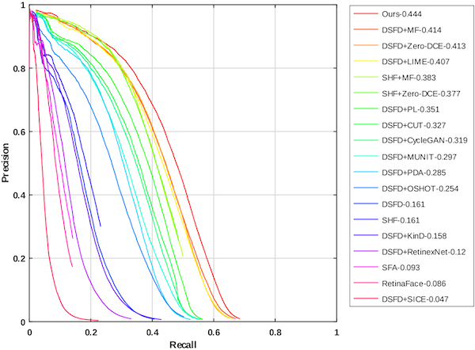

# HLA-Face: Joint High-Low Adaptation for Low Light Face Detection

The official PyTorch implementation for HLA-Face: Joint High-Low Adaptation for Low Light Face Detection (CVPR21).

You can find more information on our [project website](https://daooshee.github.io/HLA-Face-Website/).

------


## 1. Description

Our face detection mAP on DARK FACE test set (*trained without DARK FACE labels*): 44.4

Precision-Recall (PR) curves on DARK FACE.

 


## 2. Training code

Please follow [[Training Code]](https://github.com/daooshee/HLA-Face-Code/tree/main/train_code) to download and prepare the dataset.

Basically, to train the final Joint High-Low Adaptation framework

```
cd ./train_code
python train.py --multigpu
```

More details are given in [[Training Code].](https://github.com/daooshee/HLA-Face-Code/tree/main/train_code)


## 3. Testing code

First, download and `cd ./test_code`.


### 3.1 Requirements

- Python 3

- PyTorch 1.2.0

  - Higher versions may cause the `RuntimeError: Legacy autograd function with non-static forward method is deprecated. Please use new-style autograd function with static forward method` bug.

  - According to https://github.com/yxlijun/DSFD.pytorch, PyTorch 0.3 is also OK, but we have not checked it.

- opencv

- numpy

- easydict


### 3.2 Demo

Download the checkpoints from [[Google]](https://drive.google.com/drive/folders/1OQOqbf3OXhRZvRmIu9Bbg-rjKKLh4lHv?usp=sharing) [[Baidu (xnb6)]](https://pan.baidu.com/s/1kUnhuSUQ9g4d7jpO0doviA), and save them as:

```
./final_weights/Illumination-Enhancer.pth
./final_weights/Face-Detector.pth
```

This script detects the example `test.png` image. 

```bash
python test.py
```

The detection result (a text file) can be found in `./result/` and visualized by `draw_result.py`

Here, the left image is `test.png`, and the right image is the visualized face detection result.

 


### 3.3 Test more images

You can further edit the function `load_images()` in `test.py` to load your testing images. The detection results can be found in ./result where each detection result is named by the name of the testing image.

For example, to test the DSFD test dataset:

```python
def load_images():
    import glob
    return glob.glob('./YOUR_PATH_TO_DARKFACE/images/test/*.png')
```

If you want to run without the multi-scale testing scheme (the mode we used in ablation studies), set:

```python
USE_MULTI_SCALE = False
MY_SHRINK = 2
```


------

This code is based on [DSFD](https://github.com/yxlijun/DSFD.pytorch). Thanks a lot for the great work!
